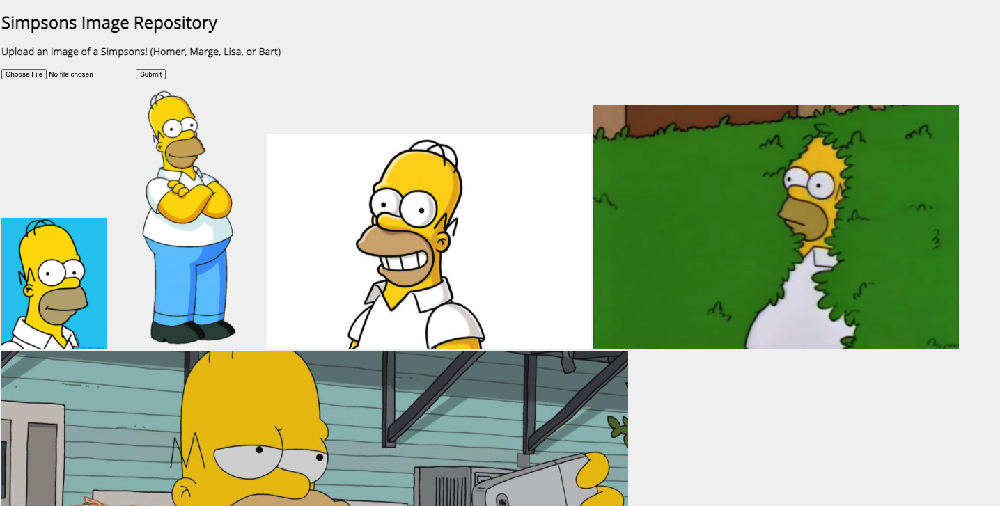

# Shopify Challenge: Image Repository

## Preview

## Summary

Thank you for considering my coding challenge submission for the role of Backend Developer at Shopify.

The theme of my image repository are images from the main characters in the Simpsons including Homer, Marge, Bart, and Lisa. 

Here is a summary of the features I have implemented for the image repository:

- Search for images of a character via uploading an image of that same character
  - Fine-tuned a convolutional neural network (Resnet) to classify an image with either Homer, Marge, Bart, or Lisa on Kaggle dataset (Please see my [Kaggle notebook](https://github.com/lauradang/simpson-image-repository/blob/main/simpsons-fastai.ipynb) for details)
    - API has a confidence threshold, so the program is able to distinguish if there is no Simpsons character in the photo, thus returning 0 results
  - Classification/Prediction is used to query the SQLite database and retrieve the images of the predicted character
- Search for images of a character via text
  - Set up a database with columns:
    -  `file_path` : The path to the image in the repository
    - `title` : The title of the image
  - Takes input from search bar via `POST` endpoint call and queries the SQLite database to retrieve and display the images of the searched character

## How to Run

1. Install the necessary dependencies listed in `requirements.txt`. I recommend using a virtual environment manager such as [virtualenv](https://virtualenv.pypa.io/en/latest/) to install the dependencies via `pip install requirements.txt`.

2. Run `flask run`.

3. Open browser and go to link that the flask application is running on. The link should be given in the terminal shortly after running step 2.

4. Try it out! 

   a. Upload a picture of one of these characters to display the character's images from the repository OR

   b. Type one of "homer", "marge", "bart", or "lisa" to display images of those characters.

